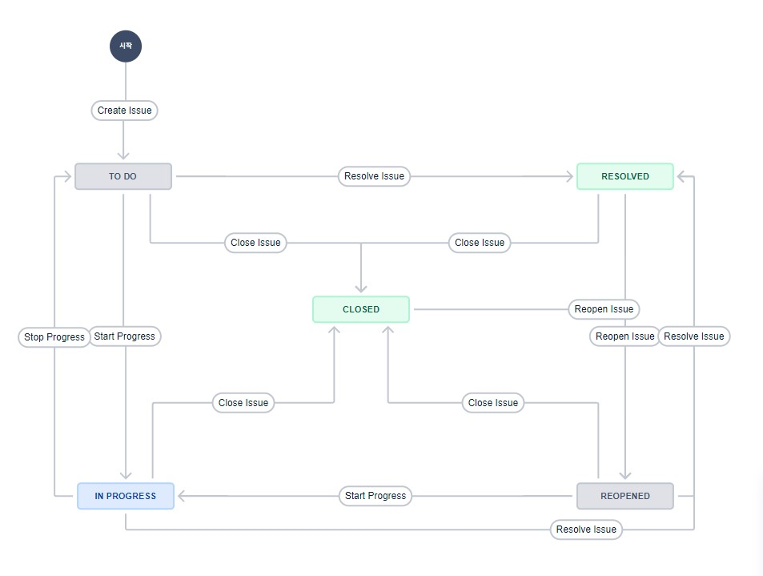

# template-jira-github

## 목표
- GitHub와 Jira를 연동
- 이슈생성, 관리 테스트

## 워크플로우

### 상태
- TO DO (해야 할 일)
- IN PROGRESS (진행 중)
- RESOLVED (해결됨)
- CLOSED (닫힘)
- REOPENED (다시 열림)

### 작업 방법
1. [Jira] 로드맵에서 에픽 및 이슈 생성
2. [Jira] 백로그에서 생성된 이슈중 작업할 것을 보드로 올리기
3. [Jira] 이슈에서 수정할, 수정한 내용을 작성
4. [GitHub] 브랜치 생성하고 작업
    Commit 시에 코멘트에 TJG-* 형식으로 이슈 ID 입력, 간단한 설명 입력
    ex) `TJG-3 create helloworld.sh`
5. [GitHub] Pull Request 작성 ([Jira] 자동으로 이슈의 상태가 `TO DO`에서 `IN PROGRESS`로 전이)
    Pull Request 작성시 내용에 TJG-* 형식으로 이슈 ID 를 입력
    Reviewers 추가
6. [GitHub] 리뷰 및 승인받기
7. [GitHub] 승인받은 Pull Request를 Merge ([Jira] 문제없이 Merge가 되면 자동으로 이슈의 상태가 `IN PROGRESS`에서 `RESOLVED`로 전이)
